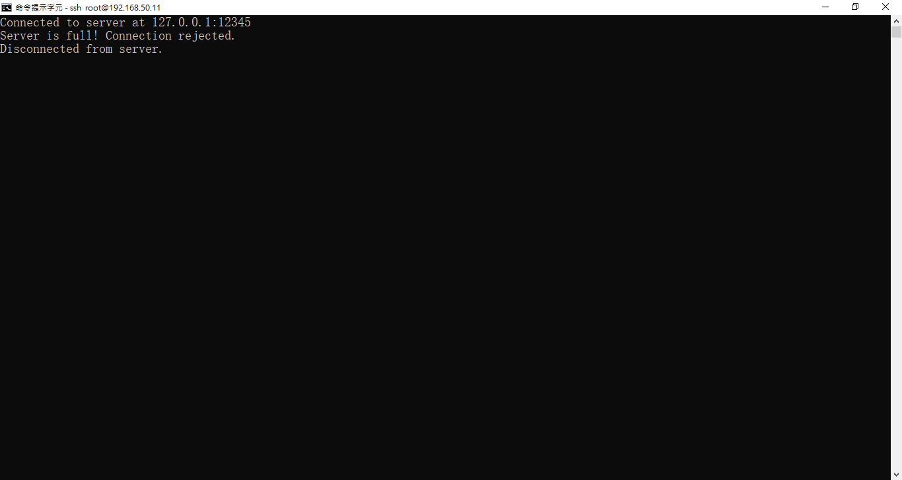
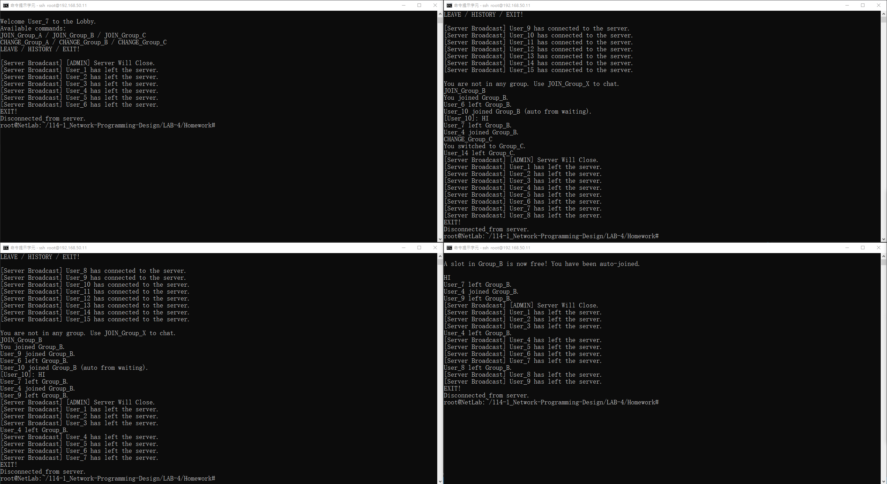

# LAB-4 多群組動態聊天室系統

## 學生資料

- **課程** 1141 網路程式設計實習(資訊三合)[1402]
- **班級** 資訊三乙
- **姓名** 王建葦
- **學號** D1210799

## 環境需求

- Java 版本：JAVA 17 (OpenJDK)
- 經過測試在 DietPi v9.18.1 上可以運行 (見 Demo/ENV 圖片)。

## 專案概述

本專案實作一個多群組動態聊天室系統，採用 Client-Server 架構，使用 Java Socket 程式設計實作。系統支援多客戶端同時連線、多群組聊天、自動補位機制、訊息歷史記錄等功能。

## 系統架構

系統採用多執行緒架構，伺服器為每個客戶端建立獨立的執行緒處理連線，確保多客戶端能夠並行通訊。

### 核心參數

- **伺服器埠號**：12345
- **最大客戶端數**：15
- **群組數量**：3（Group_A、Group_B、Group_C）
- **每個群組最大成員數**：4

## 程式碼講解

### 伺服器端 (Server.java)

#### 類別結構

伺服器端主要包含以下組件：

1. **主要資料結構**：
   - `groups`：儲存各個群組的客戶端處理器列表
   - `waitingQueue`：等待加入群組的客戶端佇列
   - `allClients`：所有連線的客戶端列表
   - `groupHistory`：各群組的訊息歷史記錄

2. **ClientHandler 內部類別**：處理每個客戶端的獨立執行緒

#### 主要方法說明

**main 方法**

```45:106:src/Server.java
    public static void main(String[] args) {
        // 初始化三個群組的客戶端列表（使用 CopyOnWriteArrayList 確保線程安全）
        groups.put("Group_A", new CopyOnWriteArrayList<>());
        groups.put("Group_B", new CopyOnWriteArrayList<>());
        groups.put("Group_C", new CopyOnWriteArrayList<>());

        // 初始化三個群組的訊息歷史記錄（使用 LinkedList 以便高效插入和刪除）
        groupHistory.put("Group_A", new LinkedList<>());
        groupHistory.put("Group_B", new LinkedList<>());
        groupHistory.put("Group_C", new LinkedList<>());

        try (ServerSocket serverSocket = new ServerSocket(PORT)) {
            System.out.println("Server started on 127.0.0.1:" + PORT);

            // 建立後台執行緒用於處理管理員輸入（系統廣播和關閉指令）
            new Thread(() -> {
                Scanner console = new Scanner(System.in);
                while (true) {
                    String adminMsg = console.nextLine();
                    // 檢查是否為關閉伺服器指令
                    if (adminMsg.equalsIgnoreCase("/exit")) {
                        System.out.println("Server shutting down...");
                        // 廣播伺服器即將關閉的訊息給所有客戶端
                        broadcastAll("[ADMIN] Server Will Close.");
                        // 延遲一秒後關閉伺服器，讓訊息有時間傳送
                        try {
                            Thread.sleep(1000);
                        } catch (InterruptedException e) {
                            e.printStackTrace();
                        }
                        System.exit(0);
                    }
                    // 將管理員訊息廣播給所有客戶端
                    broadcastAll("[ADMIN] " + adminMsg);
                }
            }).start();

            // 主接收迴圈：持續監聽新的客戶端連線請求
            while (true) {
                // 等待客戶端連線（阻塞式）
                Socket socket = serverSocket.accept();

                // 檢查是否已達到最大客戶端數量限制
                if (allClients.size() >= MAX_CLIENTS) {
                    // 建立臨時輸出流告知客戶端伺服器已滿
                    DataOutputStream tempOut = new DataOutputStream(socket.getOutputStream());
                    tempOut.writeUTF("Server is full! Connection rejected.");
                    // 關閉連線
                    socket.close();
                    continue; // 繼續等待下一個連線請求
                }

                // 建立客戶端處理器並加入所有客戶端列表
                ClientHandler client = new ClientHandler(socket);
                allClients.add(client);
                // 啟動客戶端處理執行緒
                client.start();
            }
        } catch (IOException e) {
            e.printStackTrace();
        }
    }
```

主方法負責：
- 初始化三個群組和歷史記錄結構
- 建立 ServerSocket 監聽連線
- 啟動後台執行緒處理管理員指令（/exit）
- 主迴圈接受客戶端連線並建立 ClientHandler 執行緒

**廣播方法**

```108:158:src/Server.java
    /**
     * 群組內廣播訊息
     * 將訊息傳送給指定群組的所有成員（除了發送者）
     * 同時將訊息記錄到該群組的歷史記錄中
     * 
     * @param group 目標群組名稱
     * @param message 要廣播的訊息
     * @param sender 發送訊息的客戶端處理器（不會收到自己發送的訊息）
     */
    private static void broadcast(String group, String message, ClientHandler sender) {
        // 遍歷群組內的所有客戶端
        for (ClientHandler c : groups.get(group)) {
            try {
                // 不將訊息發送給發送者本人
                if (c != sender) {
                    c.out.writeUTF(message);
                }
            } catch (IOException e) {
                e.printStackTrace();
            }
        }
        // 將訊息加入群組歷史記錄
        List<String> history = groupHistory.get(group);
        history.add(message);
        // 如果歷史記錄超過 50 條，移除最舊的記錄（保持 FIFO）
        if (history.size() > 50) {
            history.remove(0);
        }
    }

    /**
     * 全域廣播訊息
     * 將訊息傳送給所有連線的客戶端（無論他們在哪個群組或大廳）
     * 用於系統通知、管理員公告等
     * 
     * @param message 要廣播的訊息
     */
    private static void broadcastAll(String message) {
        // 遍歷所有連線的客戶端
        for (ClientHandler c : allClients) {
            try {
                // 檢查輸出流是否有效（避免已斷線的客戶端造成錯誤）
                if (c.out != null) {
                    // 加上 [Server Broadcast] 前綴以便客戶端識別
                    c.out.writeUTF("[Server Broadcast] " + message);
                }
            } catch (IOException ignored) {
                // 忽略個別客戶端的 IO 錯誤，繼續處理其他客戶端
            }
        }
    }
```

**自動補位機制**

```178:220:src/Server.java
    /**
     * 嘗試讓等待佇列中的客戶端自動補進有空位的群組
     * 當有客戶端離開群組時，此方法會被呼叫以自動遞補等待佇列中最早排隊的客戶端
     * 
     * @param groupFreed 有空位的群組名稱
     */
    private static void tryAutoJoin(String groupFreed) {
        // 使用迭代器遍歷等待佇列（支援在遍歷過程中移除元素）
        Iterator<ClientHandler> it = waitingQueue.iterator();
        while (it.hasNext()) {
            ClientHandler c = it.next();
            // 跳過沒有目標群組的客戶端（理論上不應該發生）
            if (c.targetGroup == null) continue;
            // 檢查此客戶端是否在等待加入該有空位的群組
            if (c.targetGroup.equals(groupFreed)) {
                List<ClientHandler> g = groups.get(groupFreed);
                // 確認群組仍有空位（雙重檢查，避免競爭條件）
                if (g.size() < MAX_GROUP_SIZE) {
                    // 將客戶端加入群組
                    g.add(c);
                    // 更新客戶端狀態
                    c.currentGroup = groupFreed;
                    c.inLobby = false;
                    // 從等待佇列中移除
                    it.remove();
                    try {
                        // 清空客戶端終端畫面
                        c.out.writeUTF("\033[H\033[2J");
                        // 通知客戶端已自動加入群組
                        c.out.writeUTF("A slot in " + groupFreed + " is now free! You have been auto-joined.\n");
                        // 廣播給群組其他成員：有新成員自動加入
                        broadcast(groupFreed, c.userName + " joined " + groupFreed + " (auto from waiting).", c);
                    } catch (IOException e) {
                        e.printStackTrace();
                    }
                    // 只補一位，找到後即停止
                    break;
                }
            }
        }
        // 更新剩餘等待客戶端的排隊位置資訊
        updateWaitingQueuePositions();
    }
```

**ClientHandler 執行緒**

每個客戶端連線都會建立一個獨立的 ClientHandler 執行緒，負責處理該客戶端的通訊：

```252:315:src/Server.java
        /**
         * 客戶端處理執行緒的主迴圈
         * 負責接收客戶端訊息並進行相應處理
         */
        public void run() {
            try {
                // 建立資料輸入輸出流
                in = new DataInputStream(socket.getInputStream());
                out = new DataOutputStream(socket.getOutputStream());
                // 根據在 allClients 列表中的位置分配使用者名稱
                userName = "User_" + (allClients.indexOf(this) + 1);

                // 將客戶端加入大廳（顯示歡迎訊息和可用指令）
                enterLobby();

                // 廣播新客戶端連線訊息給所有線上客戶端
                // 注意：必須在 out 建立後才能廣播，否則會出錯
                broadcastAll(userName + " has connected to the server.");

                // 主訊息處理迴圈：持續接收並處理客戶端訊息
                while (true) {
                    // 從客戶端讀取訊息（阻塞式，直到收到訊息）
                    String msg = in.readUTF();

                    // 處理 EXIT! 指令：客戶端主動退出
                    if (msg.equalsIgnoreCase("EXIT!")) {
                        handleExit();
                        break;
                    }
                    // 處理 JOIN_Group_X 指令：加入指定群組
                    else if (msg.startsWith("JOIN_")) {
                        handleJoin(msg.substring(5)); // 提取群組名稱
                    }
                    // 處理 CHANGE_Group_X 指令：切換到另一個群組
                    else if (msg.startsWith("CHANGE_")) {
                        handleChange(msg.substring(7)); // 提取新群組名稱
                    }
                    // 處理 LEAVE 指令：離開當前群組回到大廳
                    else if (msg.equalsIgnoreCase("LEAVE")) {
                        handleLeave();
                    }
                    // 處理 HISTORY 指令：查看當前群組的訊息歷史
                    else if (msg.equalsIgnoreCase("HISTORY")) {
                        handleHistory();
                    }
                    // 處理 BROADCAST 指令：全域廣播訊息（給所有客戶端）
                    else if (msg.startsWith("BROADCAST ")) {
                        broadcastAll("[User Broadcast] " + userName + ": " + msg.substring(10));
                    }
                    // 如果客戶端在群組內，將訊息作為聊天訊息廣播到群組
                    else if (currentGroup != null) {
                        String formatted = "[" + userName + "]: " + msg;
                        broadcast(currentGroup, formatted, this);
                    }
                    // 如果客戶端不在群組內，提示需要先加入群組
                    else {
                        out.writeUTF("You are not in any group. Use JOIN_Group_X to chat.");
                    }
                }
            } catch (IOException e) {
                // 當連線中斷時（客戶端異常斷線），處理斷線邏輯
                handleDisconnect();
            }
        }
```

**指令處理方法**

- `handleJoin`：處理加入群組指令，若群組已滿則加入等待佇列
- `handleChange`：處理切換群組指令
- `handleLeave`：處理離開群組指令，觸發自動補位機制
- `handleHistory`：顯示群組訊息歷史記錄（最多 50 條）
- `handleExit`：處理客戶端主動退出
- `handleDisconnect`：處理異常斷線

### 客戶端 (Client.java)

客戶端採用雙執行緒架構：主執行緒處理使用者輸入，獨立執行緒處理伺服器訊息接收。

```29:77:src/Client.java
    public static void main(String[] args) {
        try (Socket socket = new Socket(HOST, PORT)) {
            System.out.println("Connected to server at " + HOST + ":" + PORT);

            // 建立資料輸入輸出流
            // DataInputStream 用於接收伺服器傳送的 UTF-8 編碼字串
            DataInputStream in = new DataInputStream(socket.getInputStream());
            // DataOutputStream 用於發送 UTF-8 編碼字串至伺服器
            DataOutputStream out = new DataOutputStream(socket.getOutputStream());

            // 建立訊息接收執行緒（獨立執行緒處理伺服器訊息）
            // 使用獨立執行緒避免阻塞使用者輸入，讓程式能同時接收訊息和處理輸入
            Thread receiveThread = new Thread(() -> {
                try {
                    // 持續接收伺服器訊息（阻塞式讀取）
                    while (true) {
                        // 從伺服器讀取 UTF-8 編碼的字串訊息
                        String msg = in.readUTF();
                        // 將接收到的訊息輸出到終端
                        System.out.println(msg);
                    }
                } catch (IOException e) {
                    // 當連線中斷時（伺服器關閉或網路錯誤），顯示斷線訊息
                    System.out.println("Disconnected from server.");
                }
            });
            // 啟動接收執行緒（開始在背景執行）
            receiveThread.start();

            // 主執行緒處理使用者輸入和訊息傳送
            // 使用 BufferedReader 讀取標準輸入（鍵盤輸入）
            BufferedReader reader = new BufferedReader(new InputStreamReader(System.in));
            String msg;
            // 持續讀取使用者輸入（每行視為一條訊息）
            while ((msg = reader.readLine()) != null) {
                // 將使用者輸入的字串以 UTF-8 編碼發送至伺服器
                out.writeUTF(msg);
                // 如果使用者輸入 EXIT!，結束迴圈並關閉連線
                if (msg.equalsIgnoreCase("EXIT!")) {
                    break;
                }
            }

        } catch (IOException e) {
            // 處理連線失敗的情況（伺服器未啟動、網路問題等）
            System.out.println("Connection failed: " + e.getMessage());
        }
        // try-with-resources 會自動關閉 Socket，無需手動關閉
    }
```

## 系統功能

### 可用指令

- **JOIN_Group_A / JOIN_Group_B / JOIN_Group_C**：加入指定群組
- **CHANGE_Group_A / CHANGE_Group_B / CHANGE_Group_C**：切換到另一個群組
- **LEAVE**：離開當前群組並返回大廳
- **HISTORY**：查看當前群組的訊息歷史（最多 50 條）
- **EXIT!**：離開伺服器
- **一般訊息**：在群組內直接輸入文字即可發送聊天訊息

### 自動補位機制

當群組成員離開時，系統會自動檢查等待佇列，將最早排隊等待加入該群組的使用者自動補入，確保群組人數維持在最大容量。

### 等待佇列

當使用者嘗試加入已滿的群組時，會被加入等待佇列。系統會即時更新佇列中所有使用者的排隊位置資訊。

## 功能測試

### Demo 01: 連線測試

#### 測試情境 1：伺服器人數上限


**情境說明**：
當第 16 位使用者嘗試連線伺服器時，顯示：

```
Server is full! Connection rejected.
Disconnected from server.
```

**功能驗證**：
這符合程式中 MAX_CLIENTS = 15 的限制。第 16 位 client 嘗試連線時，伺服器立即拒絕連線並主動關閉 socket。
功能測試結果：伺服器人數上限機制運作正常。

#### 測試情境 2：使用者連線與全域廣播


**情境說明**：
User_1 連線成功，顯示：

```
Welcome User_1 to the Lobby.
Available commands: ...
```

接著看到大量訊息：

```
[Server Broadcast] User_2 has connected to the server.
...
[Server Broadcast] User_15 has connected to the server.
```

**功能驗證**：
這顯示所有使用者（直到第 15 位）都成功連線，而伺服器會向所有現有客戶端廣播每一位新使用者的加入訊息。由於 User_1 是最早連線者，所以他會收到 2~15 號所有後續用戶的登入通知。
功能測試結果：全域廣播（Server Broadcast）正常。

#### 測試情境 3：多客戶端同步廣播


**情境說明**：
畫面顯示多個使用者（User_2、User_3、User_4...）的終端畫面。每個使用者都看到：

```
[Server Broadcast] User_X has connected to the server.
```

**功能驗證**：
這是多個 client 同時啟動的情況。每個 client 都會收到他自己之後加入的所有新使用者登入廣播。
例如：
- User_2 會看到 User_3~15 的登入
- User_3 會看到 User_4~15 的登入

功能測試結果：伺服器成功同步廣播給所有線上 client。

#### 測試情境 4：多執行緒穩定性


**情境說明**：
4 個終端並列顯示（四位使用者同時在線）。每個畫面皆顯示 [Server Broadcast] 訊息。

**功能驗證**：
這代表伺服器的多執行緒運作穩定。每個 client 的訊息接收 loop 正常執行，沒有 I/O 阻塞或競爭問題。
功能測試結果：多線程（pthread-like）通信穩定運作。

#### 測試情境 5：後續連線者廣播


**情境說明**：
User_6、User_7、User_8、User_9 等後半段使用者成功登入。終端中顯示：

```
[Server Broadcast] User_9 has connected to the server.
[Server Broadcast] User_10 has connected to the server.
...
```

**功能驗證**：
這是伺服器處理「後續連線者」的廣播效果。所有在 Lobby 的 client 會即時看到誰加入了伺服器。
功能測試結果：伺服器廣播無延遲、即時性良好。

#### 測試情境 6：最大容量測試


**情境說明**：
User_11 至 User_15 的畫面。例如：

```
Welcome User_11 to the Lobby.
[Server Broadcast] User_11 has connected to the server.
[Server Broadcast] User_12 has connected to the server.
...
```

**功能驗證**：
伺服器對於每個新登入者都正確地廣播至目前所有活躍 client。同時第 15 位（最後一位）成功連線，沒有任何錯誤訊息。
功能測試結果：伺服器最大容量（15人）可完全穩定支援。

#### 測試情境 7：所有使用者連線成功


**情境說明**：
畫面顯示多個使用者（User_12~User_15）的 Lobby 狀態。每個人都看到：

```
Welcome User_X to the Lobby.
[Server Broadcast] User_15 has connected to the server.
```

**功能驗證**：
這代表所有 15 位 client 均已成功連線且同時保持在線，伺服器未出現崩潰或資源衝突。第 15 位使用者的登入廣播已同步顯示給所有前 14 位 client。
功能測試結果：伺服器廣播完整、所有使用者接收一致。

### Demo 02: 離開群組測試

#### 測試情境 1：使用者登入 Lobby


**情境說明**：
畫面顯示 User_11 成功登入伺服器並進入 Lobby。畫面出現：

```
Welcome User_11 to the Lobby.
Available commands:
JOIN_Group_A / JOIN_Group_B / JOIN_Group_C
CHANGE_Group_A / CHANGE_Group_B / CHANGE_Group_C
LEAVE / HISTORY / EXIT!
```

**功能驗證**：
此畫面為登入後的初始狀態，代表伺服器成功接收用戶連線並傳送指令提示。尚未加入任何群組，處於「大廳」等待階段。

#### 測試情境 2：自動補位機制


**情境說明**：
此畫面同時顯示多個使用者（例如 User_13、User_14、User_15）與 Group_C 的互動。其中可見：

```
User_11 left Group_C.
User_15 joined Group_C (auto from waiting).
[User_15]: Hi
```

**功能驗證**：
User_11 離開 Group_C 後，伺服器自動檢查等待佇列，將原先排隊等待的 User_15 自動加入該群組。顯示 (auto from waiting)，代表自動遞補成功。同時，其他群組成員可立即看到訊息同步更新，並能進行聊天。

#### 測試情境 3：自動補位通知


**情境說明**：
User_11 仍然是離開 Group_C 的觸發者。畫面顯示：

```
User_11 left Group_C.
User_15 joined Group_C (auto from waiting).
```

**功能驗證**：
這是伺服器自動補位機制的正常行為。當群組成員數低於上限，且大廳有人等待加入同一群組時，系統會立即將最早排入的使用者自動補入。群組內的其他使用者會收到這一更新通知。

#### 測試情境 4：Group_A 自動補位


**情境說明**：
顯示四個使用者同時在線的畫面（多個視窗）。畫面內容：

```
User_1 left Group_A.
User_5 joined Group_A (auto from waiting).
```

右下角視窗顯示：

```
A slot in Group_A is now free! You have been auto-joined.
```

**功能驗證**：
這是 Group_A 的離開與自動補位測試。User_1 主動離開群組後，系統立即將等待佇列中的 User_5 自動分配進 Group_A。證明自動遞補通知發送成功。

#### 測試情境 5：系統穩定性


**情境說明**：
畫面顯示 User_6 登入伺服器並停留在 Lobby。此時他尚未加入任何群組，等待下一步指令。

**功能驗證**：
該畫面用於展示伺服器在使用者離開群組後仍能穩定接受新使用者連線，不受影響。伺服器狀態保持穩定，所有指令提示可正常顯示。

#### 測試情境 6：Group_B 自動補位


**情境說明**：
四個使用者（例如 User_7、User_8、User_9、User_10）同時操作 Group_B。可見訊息：

```
User_6 left Group_B.
User_10 joined Group_B (auto from waiting).
[User_10]: HI
```

**功能驗證**：
這是 Group_B 的自動補位測試。當原本的成員 User_6 離開後，伺服器立刻從等待佇列中將 User_10 拉入群組並提示所有成員。補位完成後 User_10 立即可發送訊息，證明聊天功能恢復正常。

#### 測試情境 7：補位後立即互動


**情境說明**：
畫面顯示自動補位成功後的群組狀態。右下角視窗顯示：

```
A slot in Group_B is now free! You have been auto-joined.
HI
```

**功能驗證**：
該畫面呈現等待用戶在被自動加入群組後的回應介面。訊息「HI」證明補位後立即能與群組內的其他用戶進行互動。整個過程無延遲，表明自動分配邏輯與訊息同步皆正常。

### Demo 03: 群組切換測試

#### 測試情境 1：使用者登入


**情境說明**：
畫面顯示 User_1 成功登入伺服器並進入 Lobby。內容為：

```
Welcome User_1 to the Lobby.
Available commands:
JOIN_Group_A / JOIN_Group_B / JOIN_Group_C
CHANGE_Group_A / CHANGE_Group_B / CHANGE_Group_C
LEAVE / HISTORY / EXIT!
```

**功能驗證**：
這是伺服器初始畫面，代表連線成功且尚未加入任何群組。可見使用者當前能選擇加入或切換群組的指令。

#### 測試情境 2：群組切換與自動補位


**情境說明**：
此畫面展示多個使用者（例如 User_1～User_14）連線伺服器後的操作。其中有：

```
User_1 left Group_A.
User_5 joined Group_A (auto from waiting).
User_2 left Group_A.
User_4 left Group_A.
User_14 joined Group_A.
CHANGE_Group_B
You switched to Group_B.
User_9 left Group_B.
```

**功能驗證**：
這是群組切換（CHANGE）與自動補位（auto-join）功能的綜合測試。使用者離開 Group_A 後，系統自動讓等待中的成員進入該群組；同時有成員使用 CHANGE_Group_B 指令切換至 Group_B，顯示「You switched to Group_B.」。代表伺服器能即時處理切換與補位事件。

#### 測試情境 3：系統穩定性


**情境說明**：
畫面為單一使用者（如 User_6）登入伺服器後的 Lobby 畫面：

```
Welcome User_6 to the Lobby.
Available commands:
JOIN_Group_A / JOIN_Group_B / JOIN_Group_C
CHANGE_Group_A / CHANGE_Group_B / CHANGE_Group_C
LEAVE / HISTORY / EXIT!
```

**功能驗證**：
這代表在其他使用者進行群組切換過程中，伺服器仍可穩定接收新連線。Lobby 仍保持可用狀態，指令集完整顯示。

#### 測試情境 4：Group_B 切換測試


**情境說明**：
四個視窗同時顯示多位使用者的操作，包含群組 B 的切換情形：

```
User_6 left Group_B.
User_10 joined Group_B (auto from waiting).
[User_10]: HI
User_7 left Group_B.
User_4 joined Group_B.
User_9 left Group_B.
```

**功能驗證**：
此畫面驗證了在使用者進行 CHANGE_Group_X 操作時，伺服器可同時處理：
- 成員離開原群組
- 等待佇列自動遞補
- 聊天訊息持續正常傳送
- 補位與離開事件均即時同步給群組所有成員

#### 測試情境 5：系統持續穩定


**情境說明**：
User_11 成功登入並停留在 Lobby。

```
Welcome User_11 to the Lobby.
Available commands: ...
```

**功能驗證**：
這張圖作為穩定性測試，顯示當其他群組正在切換與補位時，伺服器仍能穩定接收新客戶端並提供指令提示。

#### 測試情境 6：Group_C 複雜切換


**情境說明**：
四個終端同時顯示 Group_C 的切換與補位：

```
User_11 left Group_C.
User_15 joined Group_C (auto from waiting).
[User_15]: Hi
User_12 left Group_C.
User_9 joined Group_C.
User_14 left Group_C.
```

**功能驗證**：
這裡可觀察到群組切換後的多重事件：
- 原成員離開群組
- 等待使用者自動補位
- 新成員立即發言（Hi）
- 其他使用者接續切換群組

整個過程顯示伺服器能正確更新每個群組的成員清單與狀態。

#### 測試情境 7：連線上限驗證



**情境說明**：
畫面顯示：

```
Server is full! Connection rejected.
Disconnected from server.
```

**功能驗證**：
此圖為連線上限測試結果，當第 16 位使用者嘗試進入伺服器時，伺服器拒絕連線並主動斷開。此行為符合系統設定的最大連線數（MAX_CLIENTS = 15）。

### Demo 04: 伺服器關閉測試

#### 測試情境 1：管理員關閉指令


**情境說明**：
畫面顯示伺服器端 PowerShell 視窗：

```
Server started on 127.0.0.1:12345
Server Will Close.
/exit
Server shutting down...
```

**功能驗證**：
這是管理員在伺服器端輸入 /exit 指令的過程。系統立即顯示「Server Will Close.」並開始執行關閉程序，準備通知所有連線用戶端伺服器即將關閉。

#### 測試情境 2：客戶端收到關閉廣播


**情境說明**：
這張圖顯示四個使用者端（User_1 ~ User_4）同時接收到伺服器的關閉廣播：

```
[Server Broadcast] [ADMIN] Server Will Close.
[Server Broadcast] User_1 has left the server.
[Server Broadcast] User_2 has left the server.
...
Disconnected from server.
```

**功能驗證**：
所有連線中的用戶都會即時收到 [ADMIN] Server Will Close. 廣播訊息，接著伺服器依序通知每位使用者的離線事件並自動中斷連線，確保關閉過程乾淨完整。

#### 測試情境 3：群組內關閉處理


**情境說明**：
此圖顯示群組中各使用者（如 User_2、User_4、User_14 等）在伺服器關閉時的狀態。內容包含：

```
[Server Broadcast] [ADMIN] Server Will Close.
User_1 has left the server.
User_2 has left the server.
User_3 has left the server.
Disconnected from server.
```

**功能驗證**：
用戶端在伺服器廣播後自動執行清理程序並安全地退出聊天室。這證明伺服器端會廣播「即將關閉」訊息並逐一通知離線狀態。

#### 測試情境 4：多視窗同時關閉



**情境說明**：
這張圖中有四個視窗顯示同時退出的場景。可見伺服器廣播後，每個使用者都依序收到離開訊息：

```
[Server Broadcast] [ADMIN] Server Will Close.
[Server Broadcast] User_1 has left the server.
[Server Broadcast] User_2 has left the server.
[Server Broadcast] User_3 has left the server.
EXIT!
Disconnected from server.
```

**功能驗證**：
使用者不需額外輸入指令，伺服器關閉事件會自動驅動客戶端關閉連線。EXIT! 表示客戶端完成自動退出並回到 shell。

#### 測試情境 5：群組聊天狀態下的關閉


**情境說明**：
畫面顯示用戶端收到伺服器廣播，並列出所有離線事件直到系統自動斷線：

```
[Server Broadcast] [ADMIN] Server Will Close.
[Server Broadcast] User_1 has left the server.
...
Disconnected from server.
```

**功能驗證**：
這證明在群組聊天狀態中，廣播機制同樣適用於所有用戶端，無論是否在 Lobby 或群組內。所有用戶皆同時接收到伺服器即將關閉的訊息。

#### 測試情境 6：多用戶同步關閉


**情境說明**：
此圖顯示多用戶環境下的最終同步狀態：

```
[Server Broadcast] [ADMIN] Server Will Close.
[Server Broadcast] User_1 has left the server.
[Server Broadcast] User_2 has left the server.
...
Disconnected from server.
```

**功能驗證**：
當管理員在伺服器端輸入 /exit 時，所有客戶端會同時被通知並安全關閉。每個視窗均顯示「Disconnected from server」字樣，表示 TCP 連線結束。

#### 測試情境 7：完整關閉流程


**情境說明**：
這張圖為 User_11 的畫面，內容顯示：

```
[Server Broadcast] [ADMIN] Server Will Close.
[Server Broadcast] User_1 has left the server.
[Server Broadcast] User_2 has left the server.
...
[Server Broadcast] User_10 has left the server.
EXIT!
Disconnected from server.
```

**功能驗證**：
這張圖代表所有連線使用者在伺服器廣播關閉時均可即時收到訊息。伺服器完成逐一通知並確實斷線，顯示伺服器端能夠乾淨地關閉所有連線執行緒。

### Demo 05: 歷史記錄功能測試


**情境說明**：
畫面內容：

```
You switched to Group_B.
User_9 left Group_B.
HISTORY
=== Last 50 Messages of Group_B ===
User_7 joined Group_B.
User_6 joined Group_B.
User_8 joined Group_B.
User_9 joined Group_B.
User_6 left Group_B.
User_10 joined Group_B (auto from waiting).
[User_10]: HI
User_7 left Group_B.
User_4 joined Group_B.
User_9 left Group_B.
=== End of History ===
```

**功能說明**：

**指令： HISTORY**
這個指令用於查看當前所在群組（此例為 Group_B）的最近 50 則訊息記錄。

**運作機制**：

使用者執行 HISTORY 時：
- 伺服器會從該群組的訊息佇列中擷取最多 50 則最近的記錄
- 記錄包含「系統事件」與「使用者訊息」

歷史內容包含：

系統事件（例如：加入、離開、自動配對）：
```
User_7 joined Group_B.
User_6 left Group_B.
User_10 joined Group_B (auto from waiting).
```

使用者訊息（例如聊天內容）：
```
[User_10]: HI
```

輸出格式：
- 開頭為 `=== Last 50 Messages of Group_B ===`
- 結尾為 `=== End of History ===`
- 方便辨識查詢範圍並避免與即時聊天訊息混淆

**驗證結果**：

這張圖顯示 HISTORY 功能能夠：
- 成功顯示群組聊天紀錄（包括使用者訊息與系統事件）
- 正確限制輸出範圍（最近 50 條）
- 不會影響當前的聊天室運作或觸發新訊息

### Demo 06: 伺服器廣播功能測試

#### 測試情境 1：伺服器關閉觸發


**情境說明**：
伺服器端 PowerShell 顯示：

```
Server started on 127.0.0.1:12345
Server Will Close.
/exit
Server shutting down...
```

**功能驗證**：
管理員輸入 /exit 指令，伺服器開始執行關閉程序。這是廣播流程的觸發點。

#### 測試情境 2：全域廣播接收


**情境說明**：
各個使用者（User_1、User_2 等）在聊天室中收到訊息：

```
[Server Broadcast] [ADMIN] Server Will Close.
```

**功能驗證**：
伺服器在關閉前，會廣播一則「[ADMIN] Server Will Close.」訊息給所有連線的用戶，表示伺服器即將關閉。這個訊息無論用戶在 Lobby 或群組內，都會收到。

#### 測試情境 3：跨群組廣播


**情境說明**：
多個視窗顯示不同用戶（User_6、User_7、User_8、User_9、User_10 等）同時收到廣播。部分使用者畫面顯示：

```
JOIN_Group_B
[Server Broadcast] [ADMIN] Server Will Close.
```

**功能驗證**：
這證明伺服器廣播是同步且跨群組的。即使使用者正位於不同聊天室（Group_A / Group_B / Group_C），皆能同時收到管理員廣播。

#### 測試情境 4：廣播不阻塞通訊


**情境說明**：
畫面中可見多組訊息：

```
User_9 joined Group_B
User_10 joined Group_B (auto from waiting).
[User_10]: HI
...
[Server Broadcast] [ADMIN] Server Will Close.
```

**功能驗證**：
在伺服器即將關閉前，仍能正常顯示使用者動作與聊天紀錄，證明廣播訊息是以獨立執行緒發送，不會阻塞現有通訊。

#### 測試情境 5：指令回應與廣播並行


**情境說明**：
用戶端包含歷史查詢紀錄與即時事件：

```
=== Last 50 Messages of Group_B ===
User_7 joined Group_B.
...
[Server Broadcast] [ADMIN] Server Will Close.
```

**功能驗證**：
這顯示伺服器能同時處理「指令回應」與「廣播訊息」，不會互相干擾。即使使用者執行 HISTORY 查詢，仍可在同一畫面收到廣播。

#### 測試情境 6：新連線使用者接收廣播


**情境說明**：
多位用戶端顯示：

```
Welcome User_12 to the Lobby.
...
[Server Broadcast] [ADMIN] Server Will Close.
```

**功能驗證**：
即使是剛登入尚未加入群組的新使用者，也能即時收到關閉訊息。這代表廣播涵蓋所有連線 socket，包括等待中的新用戶。

#### 測試情境 7：廣播最終一致性


**情境說明**：
不同使用者視窗同時顯示：

```
[Server Broadcast] [ADMIN] Server Will Close.
```

**功能驗證**：
這張圖展示伺服器廣播的最終一致性。所有用戶端（無論在 Lobby、Group_A、Group_B 或 Group_C）皆同時收到訊息，沒有延遲或遺漏。

## 總結

本系統成功實作了多群組動態聊天室的核心功能，包括：

1. **多客戶端支援**：最多支援 15 個客戶端同時連線
2. **多群組架構**：三個獨立群組，每個群組最多 4 位成員
3. **自動補位機制**：當群組有空位時自動遞補等待佇列中的使用者
4. **群組管理**：支援加入、離開、切換群組等操作
5. **訊息歷史**：每個群組保留最近 50 條訊息記錄
6. **全域廣播**：伺服器可向所有客戶端發送系統通知
7. **穩定的多執行緒通訊**：每個客戶端獨立執行緒，確保並行通訊穩定

系統通過各項功能測試，證明了多執行緒網路程式設計的穩定性和可靠性。